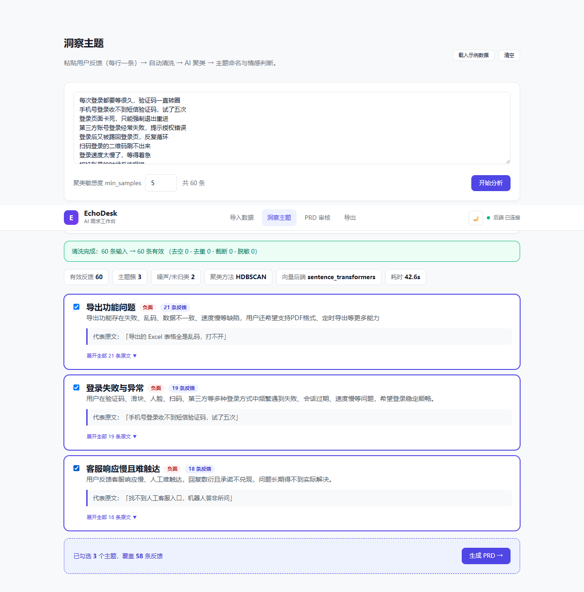
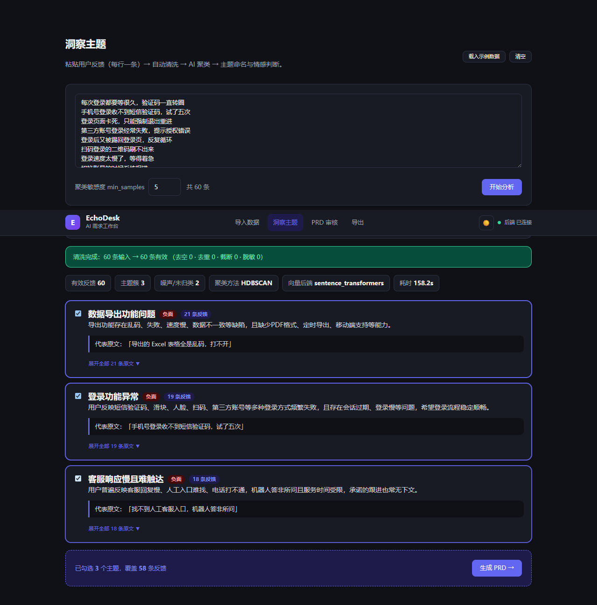
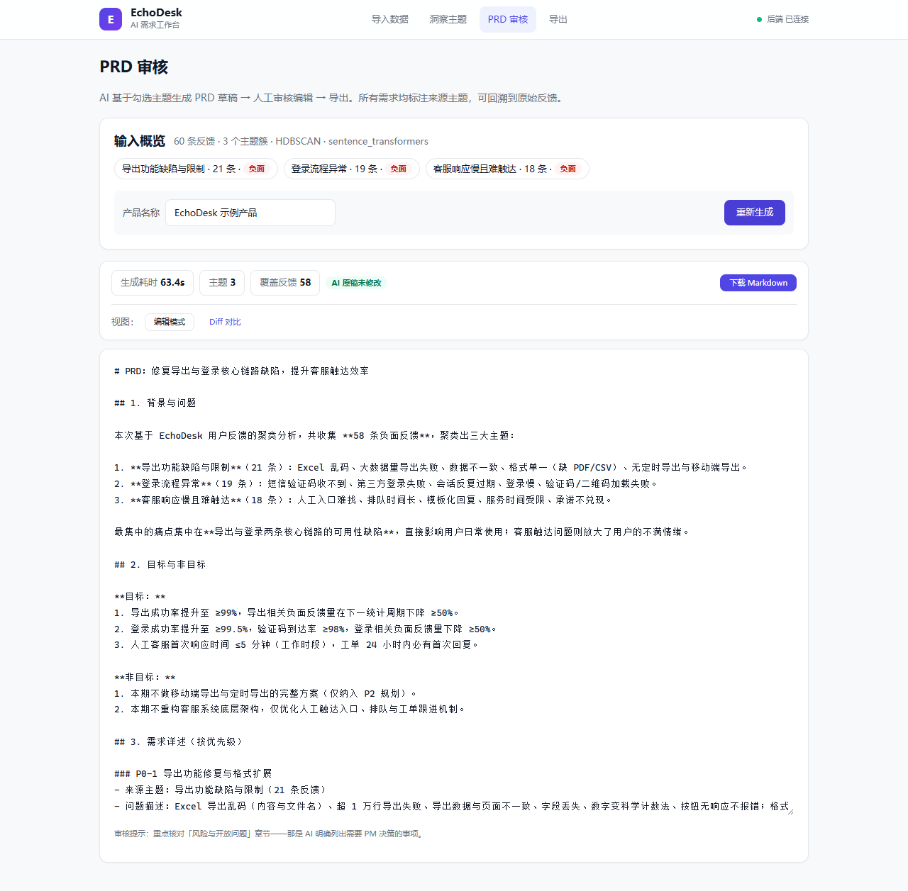
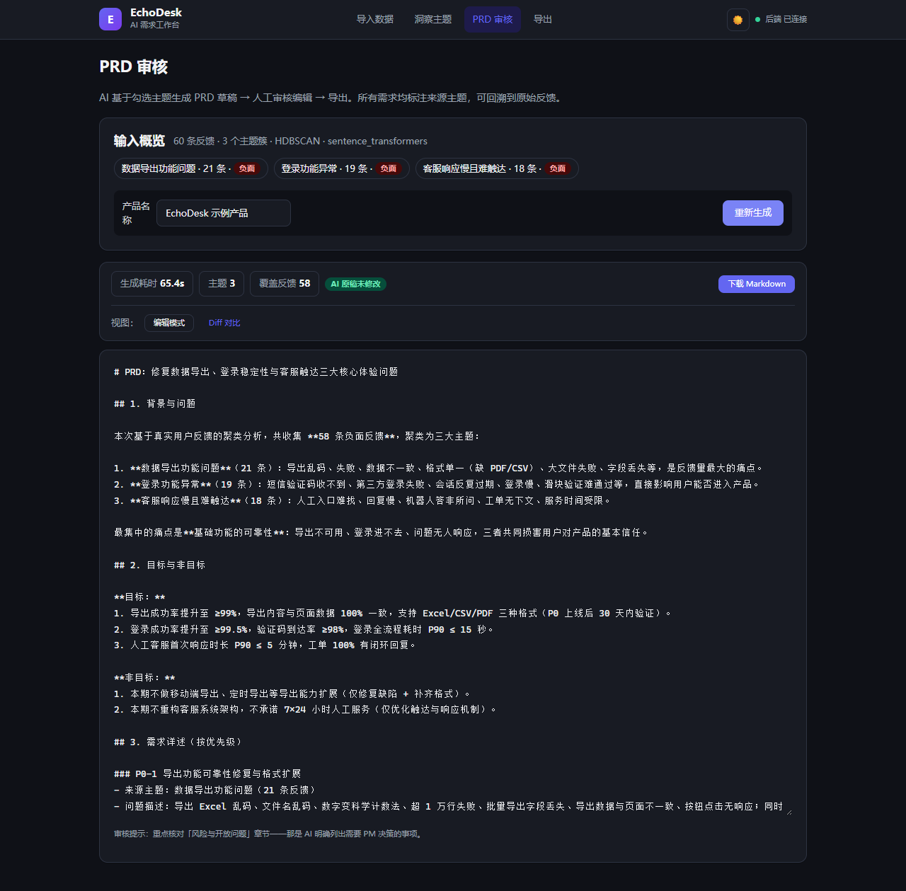

# EchoDesk · AI 需求工作台

> 把散落在问卷、访谈、应用商店评论、群聊里的海量用户反馈，通过 AI 管线自动归类、提炼洞察、生成 PRD 草稿，并由 PM 人工审核采纳。

**30 秒演示**：上传反馈文件（或粘贴文本、载入内置示例）→ 自动清洗 → 语义聚类出主题簇（含情感与代表原文）→ 勾选主题 → AI 生成结构化 PRD 草稿 → 人工审核编辑 → 导出 Markdown。

**我独立完成了**：产品定义、AI 管线设计、前后端实现、UI 设计系统、测试体系、文档与迭代决策记录——把它作为求职作品集，展示端到端的 AI 产品工程能力。

```
60 条三主题合成脱敏反馈（登录故障/导出缺陷/客服失联）
  → 清洗与去重 → 语义聚类与主题洞察 → PRD 草稿
  → 审核编辑 → 用户故事卡拆解 → Markdown / JSON / CSV 导出
```

**洞察页**——60 条杂乱反馈自动聚出 3 大主题，每簇含情感、概述与代表原文，可展开回溯全部成员：



**暗色模式**：顶部一键切换，护眼且适合演示环境。



***

## 1. 解决什么问题

产品经理每周要花数小时整理杂乱的用户反馈：问卷开放题、应用商店评论、客服工单、群聊记录——格式不一、语言口语化、真假诉求混杂。人肉归类的结果是：

- **慢**：几百条反馈整理一次要半天到一天

- **糙**：凭印象归类，主题边界模糊，小样本诉求被淹没

- **断**：从"反馈"到"PRD"之间没有可追溯的链路——评审会上没人说得清某条需求到底来自多少条反馈

（用户调研详情见 [docs/01-user-research.md](docs/01-user-research.md)）

## 2. 方案：一条可回溯的 AI 管线

```
导入            清洗              洞察                 生成           审核
CSV/XLSX/TXT → 去空/去重/截断 → 语义向量 → 降维 →  →  LLM 生成     →  人工编辑
粘贴文本        手机号/邮箱脱敏    HDBSCAN 密度聚类      结构化 PRD      还原 AI 原稿
               (M1)             + LLM 主题命名/情感     (M5)          下载 .md (M5)
                                 (M2/M3)
```

每一步的产出都可回溯到原始反馈：簇卡片可展开全部成员原文；PRD 的每条需求都标注**来源主题与反馈量**（如「来源：登录流程故障频发，19 条」）。

## 3. AI 设计立场：能力边界的三个决策

这个项目对"AI 在需求工作流中该扮演什么角色"有明确立场，也是与"全自动生成 PRD"工具的核心差异：

1. **AI 聚类，人不圈定**——主题从数据中密度聚类而来（HDBSCAN 自动判簇数、拒绝噪声），而非预置分类体系。防止"先有结论再找证据"。
2. **AI 起草，人必审**——PRD 永远以"草稿"存在，审核页强制经过人工编辑确认；AI 原稿保留可随时还原对比。Prompt 中专门要求 AI 列出「风险与开放问题」——明确标出需要人类决策的事项，而不是假装全知。
3. **降级不断服**——LLM 真实调用失败时自动降级到本地 embedding / mock 模式（独立熔断），管线永远能跑通、状态前端可见。AI 是增强，不是单点依赖。

**PRD 审核页**——AI 生成结构化草稿（每条需求标注来源主题与反馈量），人工编辑后导出；可随时还原 AI 原稿对比：





## 4. 工程亮点（面试官可能关心的）

- **四级向量降级链**：真实 Embedding API → 本地 sentence-transformers（bge-small-zh，隐私模式）→ TF-IDF → 哈希；聚类降级 HDBSCAN → KMeans（轮廓系数自动选 K）

- **历史 LLM 调参记录**：方舟 glm-5-3-flash 生成 PRD 时，深度思考曾耗尽 `max_tokens` 配额导致正文为空（213s 白跑）。定位后以 `reasoning_effort=low` 解决；当前无 key 时默认走 mock。详见 [迭代日志](docs/04-iteration-log.md)

- **中文数据现实**：CSV 解析做了 BOM 剥离与 GBK 检测链（Excel 另存/中文 Windows 记事本两大坑），零第三方探测依赖

- **测试**：83 个后端单元测试 + 37 个前端组件/工具测试离线跑完（LLM 全 mock）；另有显式开启的 Playwright 浏览器 E2E

- **UI 设计系统**：自研 CSS tokens + 共享组件，无 UI 库依赖；支持响应式布局与系统/手动暗色模式

- **Prompt 版本化**：PRD 生成 Prompt 独立文件管理（`backend/app/prompts/prd/generation.txt`），不散落在代码里

## 5. 效果验证（MVP 实测）

| 验证项            | 结果                                                    |
| -------------- | ----------------------------------------------------- |
| 聚类质量（60 条合成三主题） | 自测得到 3 簇，边界样本可能被识别为噪声；结果随 embedding 和参数变化 |
| 主题命名质量         | 自测 3/3 合理；真人 PM 盲评尚未完成                                      |
| PRD 生成         | Mock 模式可离线生成确定性占位草稿；真实 LLM 质量需使用已配置的 OpenAI 兼容端点单独验证 |
| 编码兼容           | GBK / UTF-8 BOM / XLSX 实测无乱码                          |
| 降级链            | LLM 断连时管线照常应答，前端显示降级状态                                |

（指标体系与盲评设计见 [docs/03-metrics.md](docs/03-metrics.md)）

## 6. 快速开始

```bash
# 后端（Python 3.12+）
cd backend
python -m venv .venv && .venv\Scripts\activate    # Windows
pip install -r requirements.txt
copy .env.example .env                            # 填入你的 LLM key（或保持 LLM_MODE=mock 离线体验）
uvicorn app.main:app --port 8001

# 前端（Node 18+）
cd frontend
npm install
npm run dev                                        # http://localhost:5173
```

- 正式演示数据：上传 `data/demo/flowdesk_feedback.csv`，在导入页选择 `feedback_text` 列；完整字段说明和演示话术见 [`data/demo/SOURCE.md`](data/demo/SOURCE.md)

- 没有 LLM key？设 `LLM_MODE=mock` 即可离线跑通全流程（聚类走本地向量，LLM 返回确定性占位结果）

- 本地开发后端使用 `8001`；Docker Compose 后端使用 `8003`（容器内部仍为 `8000`），Docker 前端默认使用 `5174`（容器内部仍为 `80`），避免与本机已有服务冲突；可通过 `FRONTEND_PORT` 覆盖

- 支持任意 OpenAI 兼容端点（火山方舟 / 智谱 / DeepSeek / OpenAI），配置说明见 `backend/.env.example`

- 首次运行本地向量模式会下载 bge-small-zh 模型（约 100MB）；无网环境自动降级 TF-IDF

### 6.1 一键 Docker 运行（推荐给面试官 30 秒观感）

```bash
docker compose up --build
# 前端 http://localhost:5174 ，后端 http://localhost:8003
```

- 无需在本机装 Python/Node/模型：前端 Nginx 托管静态资源并反代 `/api`，后端容器内自带全部依赖

- 无 LLM key 时容器默认 `LLM_MODE=auto`，自动回退 mock，离线即可演示全流程

- 数据与上传会落到命名卷 `echodesk-data` / `echodesk-uploads`，重启不丢失

> Docker 与本地两种跑法产物一致；`docker compose up` 首次需拉取镜像并下载本地向量模型（约 100MB）。

## 7. 技术架构

```
frontend/  React 18 + TypeScript + Vite（自研 UI 设计系统，路由 react-router）
   │  5 页面：导入 / 洞察 / PRD 审核 / 导出 / 历史记录
   │  响应式布局 + 暗色模式 + Vitest/React Testing Library 组件测试
   ▼  fetch（dev 经 Vite 代理）
backend/   FastAPI + pydantic-settings
   ├─ api/pipeline.py    REST 端点（import/clean/cluster/prd-gen/task-cards + SSE）
   ├─ api/reviewlog.py   审核事件上报与采纳率统计
   ├─ services/
   │   ├─ ingest.py      CSV/XLSX/TXT 解析（编码链）
   │   ├─ clean.py       清洗（纯函数）
   │   ├─ cluster.py     向量→UMAP→HDBSCAN/KMeans（独立熔断）
   │   ├─ insight.py     主题命名、情感和痛点摘要
   │   ├─ prd.py         PRD 生成（live/mock/auto）
   │   ├─ tasks.py       确定性用户故事卡模板
   │   └─ reviewlog.py   JSONL 追加、轮转与统计
   ├─ core/llm.py        LLM Provider 抽象：live/mock/auto + 重试 + 熔断降级
   └─ prompts/            聚类命名与 PRD Prompt 版本化文件
```

当前 MVP 不使用数据库：审核事件写入 JSONL，处理历史保存在浏览器 `localStorage`；`sqlmodel` 仍是依赖文件中的预留依赖，尚未作为应用存储层使用。

## 8. 项目文档

- [项目上下文：当前状态、架构、限制与关键决策](CONTEXT.md)

- [待办事项：只保留尚未完成的任务](TODO.md)

- [项目计划与范围](docs/00-project-plan.md)

- [用户调研](docs/01-user-research.md)

- [PRD](docs/02-prd.md)

- [指标与验证](docs/03-metrics.md)

- [迭代与决策记录](docs/04-iteration-log.md)（按版本记录技术决策、备选方案与后果）

- [竞品分析](docs/05-competitive-analysis.md)

## 9. 路线图

- **v0.7 ✅**：响应式布局、暗色模式、前后端单元测试补全

- **v0.8 ✅**：GitHub Actions CI；Docker Compose 一键运行；浏览器端 e2e 测试（Playwright，`E2E=1` 显式触发，截图脚本复用）

- **v1.1 ✅**：用户故事卡任务拆解；浏览器本地处理历史；审核 JSONL 日志自动归档；版本标识统一为 `1.1.0`

- **待定增强**：多轮反馈增量合并、需求去重与关联（跨批次）、词云、多语言、Jira/飞书对接；详见 [TODO.md](TODO.md)

## 10. 技术栈

React 18 · TypeScript · Vite · Vitest · React Testing Library（37 tests） | FastAPI · pydantic | UMAP · HDBSCAN · sentence-transformers(bge-small-zh) | OpenAI 兼容 LLM API（火山方舟 glm-5-3-flash 实测） | pytest（83 tests）

***

*本项目的产品文档、PRD、迭代决策记录同样由 AI 辅助 + 人工审核完成——它自己就是自己目标工作流的一次实践。*
